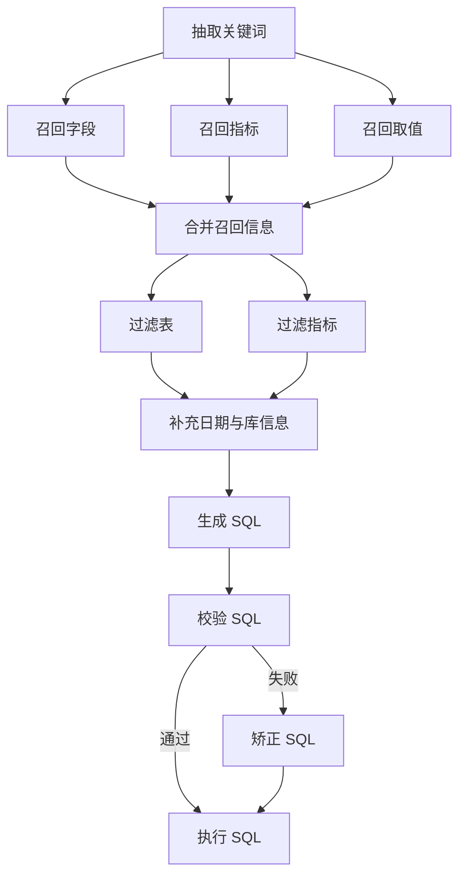

# Data Agent

用自然语言查询数仓的 Text-to-SQL Agent。用户提问后，系统会抽取关键词、召回表字段 / 指标 / 取值、生成并校验 SQL，最后在数仓执行，通过 SSE 把进度和结果推到前端。

## 能力

- 中文自然语言问数，结果以表格或单值指标展示
- LangGraph 多节点流水线：召回 → 过滤 → 生成 SQL → 校验 / 纠错 → 执行
- 元知识可重建：表结构写入 Meta 库，字段和指标进 Qdrant，维度取值进 Elasticsearch
- 前端实时展示分析进度与查询结果

## 架构

```
浏览器 (Vue)  --SSE-->  FastAPI  --LangGraph-->  LLM / Embedding / MySQL / Qdrant / ES
```

问数流程：




## 技术栈


| 层级  | 技术                                                              |
| --- | --------------------------------------------------------------- |
| 后端  | Python 3.12+、FastAPI、LangGraph、LangChain、SQLAlchemy、jieba       |
| 前端  | Vue 3、Vite 7                                                    |
| 存储  | MySQL 8（`meta` 元数据 + `dw` 数仓）、Qdrant、Elasticsearch 8 + IK       |
| 模型  | OpenAI 兼容 LLM、BAAI/bge-large-zh-v1.5（Text Embeddings Inference） |


## 目录

```
data-agent/
├── app/                    # 后端：Agent、API、仓库、客户端
├── conf/                   # 应用配置与元知识定义
│   ├── app_config.example.yaml
│   └── meta_config.yaml
├── docker/                 # MySQL / ES / Qdrant / Embedding 编排
├── prompts/                # Agent 提示词
├── data-agent-fronted/     # Vue 前端
└── main.py                 # FastAPI 入口
```

## 环境要求

- Python **3.12+**（建议用 [uv](https://docs.astral.sh/uv/)）
- Node.js **20.19+** 或 **22.12+**
- Docker Compose
- 可用的 OpenAI 兼容 LLM 接口

## 快速开始

### 1. 配置

```bash
cp conf/app_config.example.yaml conf/app_config.yaml
```

编辑 `conf/app_config.yaml`：

- `db_meta` / `db_dw`：与 Docker 中 MySQL 账号一致
- `llm`：填入 `model_name`、`model_provider`、`api_key`、`base_url`
- 其余 host/port 默认指向本机 Docker 映射端口

`conf/app_config.yaml` 含密钥，已加入 `.gitignore`，不要提交。

### 2. 准备 Embedding 模型

`docker/embedding/bge-large-zh-v1.5/` 下需有完整 [bge-large-zh-v1.5](https://huggingface.co/BAAI/bge-large-zh-v1.5) 权重。`pytorch_model.bin`（约 1.3GB）不入库，请自行放到该目录。

### 3. 启动依赖服务

在 `docker/` 目录：

```bash
docker compose up -d
```

会拉起：


| 服务            | 端口          | 说明                                      |
| ------------- | ----------- | --------------------------------------- |
| MySQL         | 3306        | 初始化 `meta`、`dw` 及示例订单数据                 |
| Elasticsearch | 9200        | 含 IK 分词                                 |
| Kibana        | 5601        | 可选                                      |
| Qdrant        | 6333 / 6334 | 向量检索                                    |
| Embedding     | 8081        | TEI，模型目录挂载为 `/models/bge-large-zh-v1.5` |


首次启动 MySQL 会执行 `docker/mysql/*.sql`。示例数仓为 **2025 年 Q1** 的订单数据，覆盖地区、商品、客户、销售额 / 销量，**没有退货**。

### 4. 安装后端依赖

在仓库根目录：

```bash
uv sync
```

### 5. 构建元知识

把 `conf/meta_config.yaml` 中的表、字段、指标写入 Meta 库，并为字段 / 指标 / 取值建索引（可重复执行，会先清空再写入）：

```bash
uv run python app/scripts/build_meta_knowledge.py -c conf/meta_config.yaml
```

### 6. 启动后端

```bash
uv run fastapi dev main.py
```

默认 `http://127.0.0.1:8000`。也可用：

```bash
uv run uvicorn main:app --reload --host 127.0.0.1 --port 8000
```

### 7. 启动前端

```bash
cd data-agent-fronted
npm install
npm run dev
```

开发服务器会把 `/api` 代理到 `http://localhost:8000`。浏览器打开终端里给出的地址（一般为 `http://localhost:5173`）。

## 接口

`POST /api/query`

```json
{ "query": "统计华北地区的销售总额" }
```

响应为 `text/event-stream`，每条 `data:` 后是 JSON：


| type       | 含义                                     |
| ---------- | -------------------------------------- |
| `progress` | `{ "step": "抽取关键词", "status": "running |
| `result`   | `{ "data": [ { "列名": 值 } ] }` 查询结果行    |
| `error`    | `{ "message": "..." }` 节点或链路异常         |


## 示例问题

与当前示例数仓对齐：

- 统计华北地区的销售总额
- 统计各区域的销售总额
- 销量最高的前 10 个商品
- 苹果品牌的成交总额

## 配置说明


| 文件                      | 用途                            |
| ----------------------- | ----------------------------- |
| `conf/app_config.yaml`  | 日志、双库、Qdrant、Embedding、ES、LLM |
| `conf/meta_config.yaml` | 表角色、字段别名、是否把取值同步到 ES、指标定义     |
| `prompts/*.prompt`      | 各节点提示词                        |


## 常见问题

**问数一直失败或召回为空**  
先确认 Docker 全部 healthy，再重新执行元知识构建脚本。

**SQL 能生成但结果不对**  
示例数据只覆盖 2025-Q1 订单；时间范围、库存等维度不在库中。